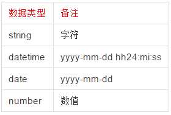

# 前端页面与后端交互协议


标题数字说明：  
1.进入具体菜单页面：（一个接口返回）  
a.获取当前工号有没有设置表头；  
返回格式:  

```
{
"headerList" : [{....},{....},{....}]
}
```
b.获取页面上数据字典;

请求格式:

```
{
    "codeType": [
        "shopName",
        "stockName",
        "tranportName"
    ]
}

```

返回格式  

```
{
    "shopName": [
        {
            "code": "220031",
            "name": "店A",
            "displaySeq": "1"
        },
        {
            "code": "220032",
            "name": "店B",
            "displaySeq": "1"
        }
    ],
    "stockName": [
        {
            "code": "230038",
            "name": "杭州仓",
            "displaySeq": "1"
        },
        {
            "code": "230039",
            "name": "杭州仓",
            "displaySeq": "1"
        }
    ]
}

```

c.获取页面列权限；
返回格式:  
2.前端根据产品需求自行决定可排序的字段；  
3.用户可自行调整的列及顺序，点击保存传给后保存；  
4.调用查询Grid 数据接口，后端返回以下具体格式数据；  
5.根据页面权限，决定是否展示按键；  
6.查询条件与后端交互协议  
查询传送格式    
```
{
    "currentPage": 2,
    "pageSize": 20,
    "sort": "stockId&asc",
    //asc升序desc只能按一个字段排序；
    "filter": [
        {
            "filed": "appName",
            "compare": "equal",
            "value": "淘宝",
            "datatype": string
        },
        //能传多种查询格式,
        见备注1{
            ....
        }
    ]
}
```
数据返回格式

```
{
"allNum" : 50
"currentPage" :2,
"pageSize" :20,
"contentList" : [{....},{....},{....}]
}
```

7.返回当前查询的总条数；  
8.点击菜单时，调用页面"权限"接口；返回当前工号页面按键权限；  

备注1：  

支持数据类型：    
 



支持的比较符有：


数据字典接口参数说明:

1.字段说明


2.新增数据字典

url: http://192.168.200.59:8080/oms/definedCode/addBaDefinedCode


Json格式：

```
{
"definedCodeType": "orderStatus",
"definedCode": "300"
"definedDesc": "",
"definedName": "打印完成",
"displaySeq": 8
}
```


3.修改数据字典  

url: http://192.168.200.59:8080/oms/definedCode/modBaDefinedCode  

Json格式：

```
{
"definedCodeType": "orderStatus",
"definedCode": "300"
"definedDesc": "",
"definedName": "打印完成",
"displaySeq": 9
}
```

4.删除数据字典  

url: http://192.168.200.59:8080/oms/definedCode/delBaDefinedCode  

Json格式：  
```
{
"definedCodeType": "",
"definedCode": ""
}
```

5.查询数据  
url: http://192.168.200.59:8080/oms/definedCode/getBaDefinedCodes  
 
Json格式：  
```
{
    [
        {
            "definedCodeType": "orderStatus",
            "definedCode": "300""definedDesc": "",
            "definedName": "打印完成",
            "displaySeq": 8
        }{
            …
        }
    ]
}

```


6。获取字典值url:  http://192.168.200.59:8080/oms/base/getComBoxListData    
请求格式  

```
{
    "codeType": [
        "shopName",
        "stockName",
        "TranportName"
    ]
}

```

返回格式

```
{
    "shopName": [
        {
            "code": "220031",
            "name": "店A",
            "displaySeq": "1"
        },
        {
            "code": "220032",
            "name": "店B",
            "displaySeq": "1"
        }
    ],
    "stockName": [
        {
            "code": "230038",
            "name": "杭州仓",
            "displaySeq": "1"
        },
        {
            "code": "230039",
            "name": "杭州仓",
            "displaySeq": "1"
        }
    ]
}
```


接口类


接口规范： http://note.youdao.com/share/?id=94ea9c53d7fe69369a7f49a6540ce863&type=note#/